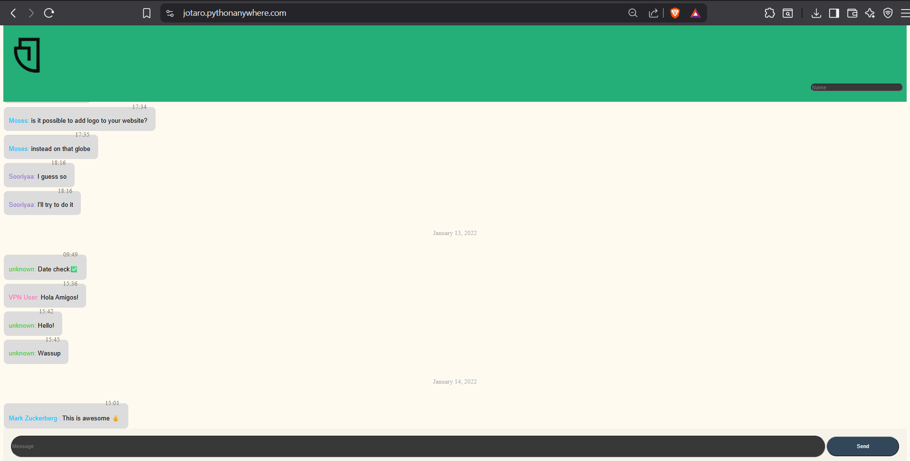
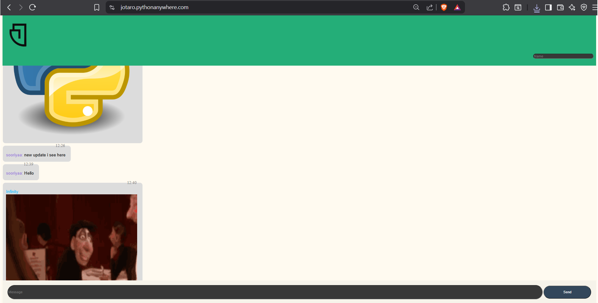

# Django Static Chat Website

A simple static chat application built with **Django** as an early Python learning project.  
The site refreshes every few seconds to update messages, stores them in a text file, and automatically displays images if image links are detected.

---

## Features
- Stores messages in a `.txt` file along with date and IP address.
- Identifies users by IP and stores their chosen name.
- Detects image URLs and displays them directly in the chat.
- Automatic page refresh every few seconds for live updates.
- Lightweight, minimal implementation for learning purposes.

---

## Screenshots

### Chat Interface

### Image Link Preview

---

## How It Works
1. **Message Storage**  
   All messages are saved in a `messages.txt` file, including timestamp, IP address, and message content.

2. **User Identification**  
   The visitor’s IP address is used to recognize and remember their name.

3. **Image Detection**  
   Links ending with `.jpg`, `.png`, `.gif`, etc., are automatically rendered as images in the chat.

4. **Auto Refresh**  
   The page reloads every few seconds to display new messages.

---
